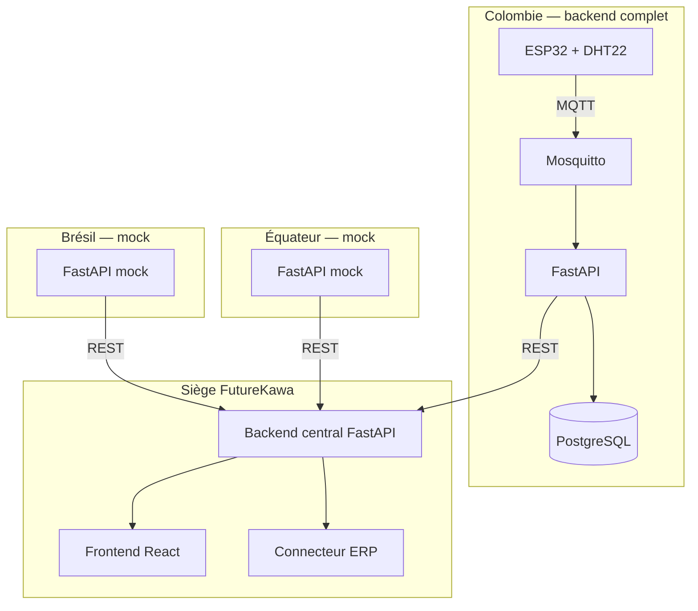
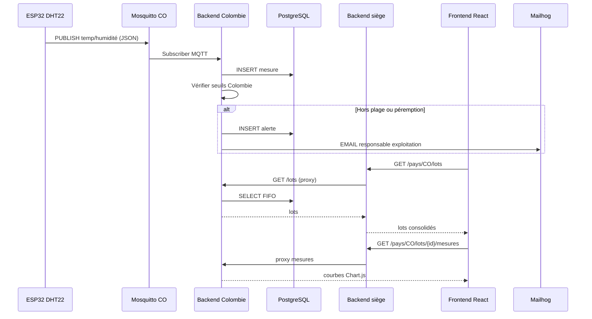

# Architecture globale — FutureKawa MSPR TPRE814

> Schéma de référence (étape 2). Export PNG pour soutenance : ouvrir ce fichier dans VS Code / GitHub (Mermaid) ou [mermaid.live](https://mermaid.live).

## Vue infrastructure (Fig. 1 sujet)



## Flux de données



## Découpage des composants

| Composant | Rôle | Port |
|-----------|------|------|
| `backend-pays-colombie` | Lots, mesures IoT, alertes locales | 8001 |
| `mocks/backends-br-ec` | Données fictives BR / EC | 8002 / 8003 |
| `backend-siege` | Agrégation, proxy, sync ERP | 8000 |
| `frontend` | UI consultation | 3000 |
| `mosquitto` | Broker MQTT Colombie | 1883 |
| `postgres-colombie` | Persistance SQL | 5432 |
| `mailhog` | SMTP de démonstration | 8025 |

## Justification architecture (C2 — ébauche)

| Critère | Choix | Argument |
|---------|-------|----------|
| **Stabilité** | Backend local par pays + siège agrégateur | Panne d'un pays n'impacte pas les autres ; données persistées localement |
| **Efficacité** | MQTT pour IoT, REST pour inter-services | MQTT léger pour capteurs ; REST standard pour consolidation |
| **Pérennité** | Docker Compose, OpenAPI, config YAML seuils | Reproductible, documenté, évolutif vers phase 2 automatisation |

## Topics MQTT (Colombie)

| Élément | Valeur |
|---------|--------|
| Topic | `futurekawa/co/ent-co-bogota-01/mesures` |
| QoS | 1 |
| Fréquence | 60 s |
| `device_id` | `FK-CO-ENT01-TH01` |

**Payload :**

```json
{"device_id": "FK-CO-ENT01-TH01", "entrepot_id": "ENT-CO-BOGOTA-01", "temperature": 26.5, "humidite": 79.2, "horodatage": "..."}
```

Broker production : `mqtt.colombie.futurekawa.internal:1883`  
Broker démo : IP LAN poste Docker (cf. `iot/esp32_dht22/config.py`).
